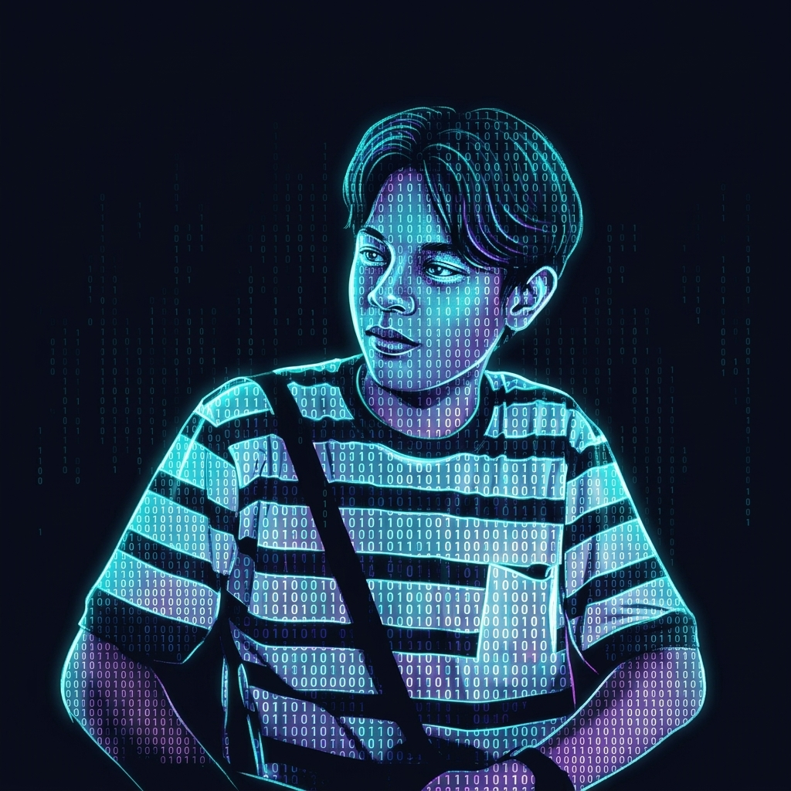

<div align="center">

<!-- Header Banner -->


<br/>

<!-- Hero Binary Identity Artwork -->
<a href="https://fikihporto.vercel.app/">
  
</a>

<br/><br/>

<!-- Dynamic Typing Subtitle -->


<br/>

<!-- Core Philosophy Badge -->

<!-- Specialization Badges -->
<p>
  
  
  
  
</p>

<!-- Quick Stats Header Badges -->
<p>
  
  
  
</p>

</div>

---

### ⚡ `01 // SYSTEM_PROFILE`

```rust
struct Developer {
    name: "Fikih Rizaldi",
    roles: ["Frontend Developer", "AI Engineer", "Fullstack Developer", "UI/UX Designer"],
    location: "Indonesia 🇮🇩",
    core_focus: "Creating seamless human-AI interactions & high-performance digital products",
    philosophy: "Turning complex binary algorithms into intuitive, visually stunning web experiences"
}
```

<table>
<tr>
<td width="60%" valign="top">

#### 🚀 **About Me**
- 💻 **Passionate Developer:** Focused on crafting modern reactive web applications, AI-driven tools, and interactive futuristic interfaces.
- 🧠 **AI Integration:** Integrating Large Language Models, generative visual pipelines, and automated intelligence into user-facing web ecosystems.
- 🎨 **Design Engineering:** Bridging the gap between engineering logic and clean, premium cyber-aesthetic design.

#### 🔭 **Currently Exploring & Refining**
- ⚡ High-performance Frontend Architecture with **Next.js & TypeScript**
- 🤖 Applied **AI Engineering**, LLM agents, and prompt workflows
- 🌐 Scalable **Fullstack Microservices** & Real-time Systems
- 🎯 Experimental 3D, WebGL & Micro-interaction UI/UX

</td>
<td width="40%" align="center" valign="middle">


</td>
</tr>
</table>

---

### 🛠️ `02 // TECH_STACK_MATRIX`

<div align="center">

<p><em>Frontend Frameworks & UI Architecture</em></p>
<a href="#">
  
</a>

<br/><br/>

<p><em>Backend, Database, AI & DevOps</em></p>
<a href="#">
  
</a>

</div>

---

### 🚀 `03 // FEATURED_PROJECTS`

<div align="center">

| Project | Domain | Description | Architecture / Tech |
| :--- | :---: | :--- | :--- |
| **🌐 UpSite** | `Web & UI` | Modern high-converting company profile and brand showcase platform | React • Next.js • Tailwind |
| **🤖 AI Web App** | `AI & ML` | AI-powered intelligent web application with interactive model pipelines | Python • AI APIs • Modern Web |
| **💼 Portfolio Website** | `Design` | Dynamic, responsive developer showcase with smooth micro-interactions | React • TypeScript • UI/UX |
| **📡 Monitoring System** | `System` | Real-time sensor and server telemetry monitoring dashboard | Node.js • WebSockets • Charts |

</div>

---

### 📊 `04 // GITHUB_ANALYTICS & ACTIVITY`

<div align="center">


<br/><br/>


</div>

---

### 🌐 `05 // CONNECT_WITH_ME`

<div align="center">

<br/>

<a href="https://github.com/FikihRizaldi" target="_blank">
  
</a>
&nbsp;&nbsp;
<a href="https://fikihporto.vercel.app/" target="_blank">
  
</a>
&nbsp;&nbsp;
<a href="mailto:fikihrizaldi31@students.amikom.ac.id" target="_blank">
  
</a>

<br/><br/>

<!-- Footer Wave Banner -->


<p align="center">
  <sub><code>01000100 01101111 01101110 01100101 // BUILT WITH PASSION BY FIKIH RIZALDI</code></sub>
</p>

</div>
